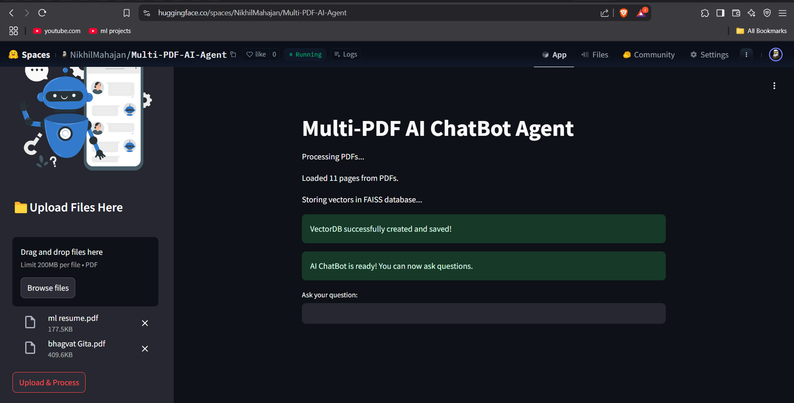
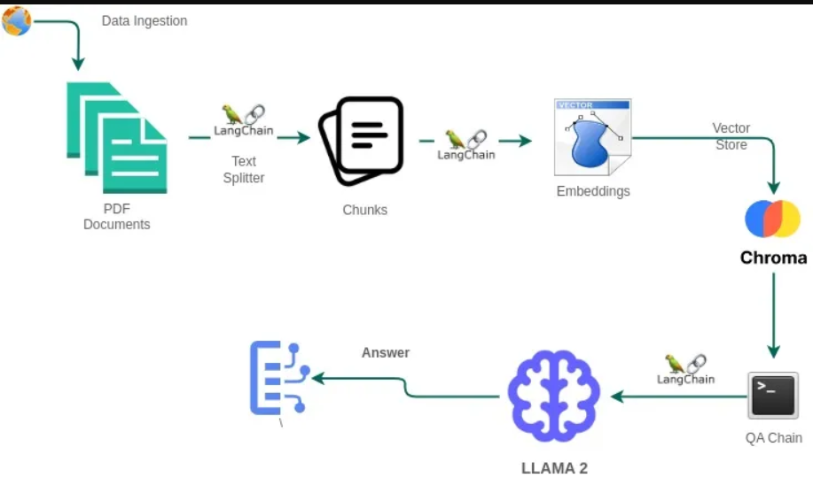
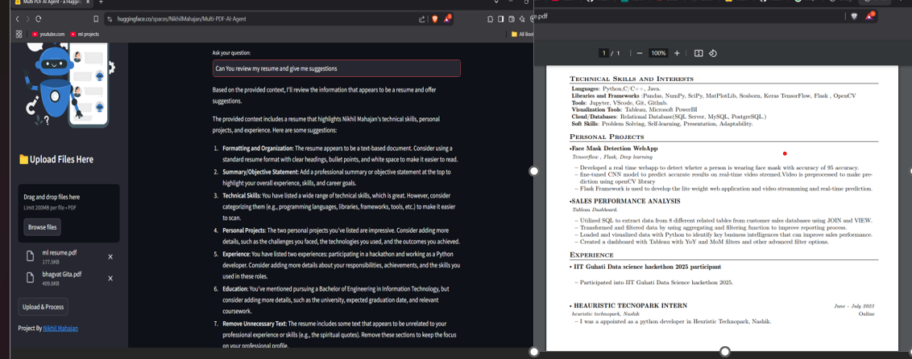
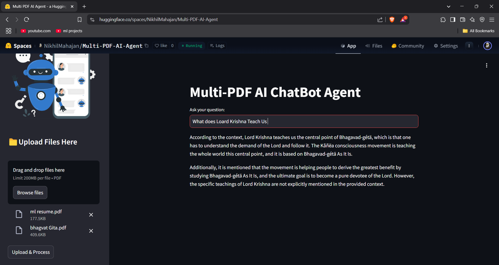
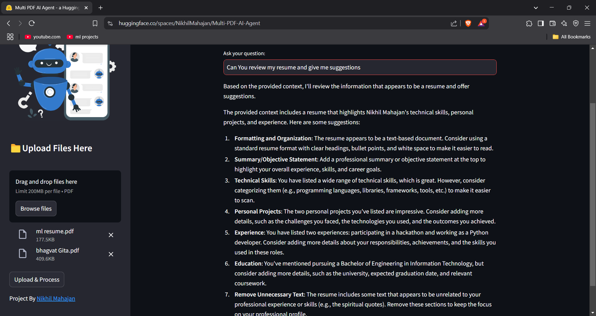

# Multi-PDF Retrieval-Augmented Generation (RAG) System

This project implements a multi-PDF retrieval-augmented generation (RAG) chatbot system that allows users to upload multiple PDF files, process them into embeddings, and ask questions based on the content of the uploaded PDFs. The system leverages FAISS, LangChain, and Streamlit to create a seamless user experience for document-based question answering.

---
# Demo 
[Clik for live Demo](https://huggingface.co/spaces/NikhilMahajan/Multi-PDF-AI-Agent)
---



# 🎯 How It Works:
------------



The application follows these steps to provide responses to your questions:

1. **PDF Loading** : The app reads multiple PDF documents and extracts their text content.

2. **Text Chunking** : The extracted text is divided into smaller chunks that can be processed effectively.

3. **Language Model** : The application utilizes a language model to generate vector representations (embeddings) of the text chunks.

4. **Similarity Matching** : When you ask a question, the app compares it with the text chunks and identifies the most semantically similar ones.

5. **Response Generation** : The selected chunks are passed to the language model, which generates a response based on the relevant content of the PDFs.





## Features

- **Multiple PDF File Upload**: Upload and process multiple PDF documents simultaneously.
- **Document Chunking**: Splits PDF content into manageable chunks to enhance retrieval accuracy.
- **FAISS Vector Database**: Stores document embeddings locally using FAISS for fast and efficient retrieval.
- **Generative AI Chatbot**: Answers user queries based on retrieved document contexts.
- **Customizable Prompt**: Tailored prompt setup to specialize the chatbot on specific knowledge domains
---

## 🌟Requirements

- **Streamlit** : A Python library for building web applications with interactive elements.
- **Llamma3** : It is a LLm. It can be used in a variety of applications such as content generation, dialogue agents, summarization and classification systems and more.
- **python-dotenv** : A library for loading environment variables from a `.env` file. This is commonly used to store configuration settings, API keys, and other sensitive information outside of your code.
- **langchain** : A custom library for natural language processing tasks, including conversational retrieval, text splitting, embeddings, vector stores, chat models, and memory.
- **PyPDFLoader** : PyPDFLoader is a library for reading and manipulating PDF files in Python. It can be used to merge, split, and modify PDFs. In the context of a multipdf chatbot, PyPDF2 could be used to handle the manipulation and generation of PDF files based on user input or responses.
- **faiss-cpu** : FAISS (Facebook AI Similarity Search) is a library developed by Facebook for efficient similarity search, Machine Learning Embeddings,Information Retrieval, content-based filtering and clustering of dense vectors.
- **langchian_huggingface** : Huggingface embeddings are used for converting text into vectors. The langchain_huggingface package provides class HuggingFaceEmbedding.
- **Groq Api** :Groq API provides access to high-performance AI inference infrastructure that enables the deployment and usage of open-source large language models (LLMs) like LLaMA, Falcon, MPT, and GPT-J. It is designed to optimize the inference process, offering low latency, high throughput, and efficient execution for large-scale AI models.

This API can be integrated into Python-based AI applications (including frameworks like LangChain) and is typically aimed at developers working with open-source LLMs who seek enhanced inference performance without the need to set up and manage complex GPU clusters.


## Installation

1. Clone the repository:
   ```bash
   git clone <repository-url>
   cd <repository-directory>
   ```

2. Create and activate a virtual environment:
   ```bash
   python -m venv env
   source env/bin/activate  # On Windows: .\env\Scripts\activate
   ```

3. Install the dependencies:
   ```bash
   pip install -r requirements.txt
   ```

4. Set up environment variables:
   - Create a `.env` file in the project root and add your GROQ API key:
     ```bash
     GROQ_API_KEY=your_groq_api_key_here
     ```

---

## Usage

1. Run the Streamlit app:
   ```bash
   streamlit run app.py
   ```

2. Upload PDF files using the sidebar file uploader.
3. Click the "Upload & Process" button to process and store embeddings.
4. Ask questions based on the uploaded PDF content through the chatbot interface.

---

## Project Structure

```
.
├── app.py                   # Main Streamlit application
├── requirements.txt         # Python dependencies
├── .env                     # Environment variables
├── pdf/                     # Temporary storage for uploaded PDFs
└── vectordb/                # FAISS vector database storage
```

---

## Key Libraries Used

- **LangChain**: For text splitting, document chains, and LLM integration.
- **FAISS**: Fast Approximate Nearest Neighbor Search for embedding storage and retrieval.
- **Streamlit**: For building the interactive UI.
- **PyPDFLoader**: Efficient PDF document loading.

---

## Custom Chat Prompt

The chatbot uses a specialized prompt designed for Maratha Samrajya history, particularly Chhatrapati Shivaji Maharaj. This ensures that the system answers questions contextually and accurately within this knowledge domain.

```text
You are a helpful AI assistant with deep expertise in the contents of the uploaded PDF files.
    Use the context extracted from the PDF documents to answer questions accurately.

    Rules:
    - ONLY use the context provided in the PDFs. Do not make up information.
    - Provide concise answers when the question is direct.
    - When appropriate, offer additional insights based on the provided context.
    - If the answer isn't found in the documents, respond with: "I'm sorry, I couldn't find the answer in the uploaded documents."

    Context:
    <context>
    {context}
    </context>

    Question: {input}

```

---

## Future Enhancements

- Add support for different file types (e.g., Word documents, images).
- Improve chatbot generalization for broader domains.
- Implement more advanced vector search techniques.

---

## Contributing

Feel free to submit issues, fork the repository, and make pull requests. Contributions are welcome!

---

## License

This project is licensed under the MIT License. See the `LICENSE` file for more information.

---

## Acknowledgements

- Inspired by LangChain's document-based RAG examples.
- Thanks to the Streamlit and FAISS communities for their excellent libraries.
